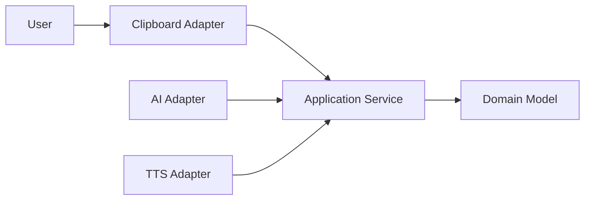

# ExplainMe

~_To get a new aquisition Lenguage_~

*Texto*

**Texto**

***Texto***

~*texto*~

_texto_

_*texto*_

_**texto**_

_***texto***_

__texto__

>Esto es una anotación
>
==text==


<u>text</u>

> [!NOTE]
> 
> This is important.


[!TIP]

[!WARNING]

[!IMPORTANT]

[!CAUTION]


!!! warning
    This is a warning.


<span style="color:red">Critical</span>


This is a <sub>subscript</sub> text
This is a <sup>superscript</sup> text
This is an <ins>underlined</ins> text

Use `git status` to list all new or modified files that haven't yet been committed.


```
git status
git add
git commit
```


------
->Esto es una flecha


========================
VERSION 3.2.0
========================
- Added encryption support
- Deprecated legacy API





## Overview
Short, high-level description of the problem this project solves
and its intended audience.

## Key Features
- Feature one (semantic, not marketing)
- Feature two
- Feature three

## Status
Project maturity: experimental | stable | deprecated

## Installation
See [docs/installation.md](docs/installation.md)

## Usage
See [docs/usage.md](docs/usage.md)

## Documentation
Full documentation available in the `docs/` directory.

## License
This project is licensed under the MIT License.


# Documentation Index

## Conceptual Overview
- [Architecture](architecture.md)
- [Design Principles](architecture.md#design-principles)

## Getting Started
- [Installation](installation.md)
- [Basic Usage](usage.md)

## Configuration
- [Configuration Options](configuration.md)

## Advanced Topics
- [Development Guide](development.md)
- [Testing Strategy](testing.md)
- [Deployment](deployment.md)

## Support
- [FAQ](faq.md)


# Architecture

## Purpose
Explain *why* the system exists.

## High-Level Design
Describe main components and their responsibilities.

## Components
### Component A
Role, inputs, outputs.

### Component B
Role, constraints.

## Design Principles
- Modularity
- Separation of concerns
- Fail-fast behavior

## Non-Goals
Explicitly state what the system does NOT attempt to solve.


# Installation

## Requirements
- Operating system
- Runtime versions
- Dependencies

## Installation Steps
1. Clone the repository
2. Install dependencies
3. Verify installation

## Verification
Run:


# Usage

## Basic Usage
Explain the minimal working example.

## Common Scenarios
### Scenario 1: Description
Steps and expected behavior.

### Scenario 2: Description
Edge cases and constraints.

## Error Handling
- Common errors
- Interpretation
- Recovery actions


# Configuration

## Configuration File Location
Explain where configuration lives.

## Options
| Option | Description | Default |
|------|------------|--------|
| timeout | Request timeout (ms) | 3000 |
| log_level | Logging verbosity | INFO |

## Options
| Option | Description | Default |
|:------  |:------------:|--------:|
| timeout | Request timeout (ms) | 3000 |
| log_level | Logging verbosity | INFO |

## Example Configuration


# Development Guide

## Development Environment
- Tools
- Editor recommendations
- Formatting rules

## Branching Model
- main
- develop
- feature/*

## Commit Message Convention


# Testing

## Test Philosophy
What is tested and why.

## Running Tests


## Test Types
- Unit tests
- Integration tests
- Regression tests


# Contributing

## Code of Conduct
Expected professional behavior.

## How to Contribute
1. Fork repository
2. Create feature branch
3. Submit pull request

## Review Process
Explain how decisions are made.


# Changelog

## [1.2.0] – 2026-01-05
### Added
- New authentication flow

### Changed
- Improved logging

### Fixed
- Memory leak in parser


